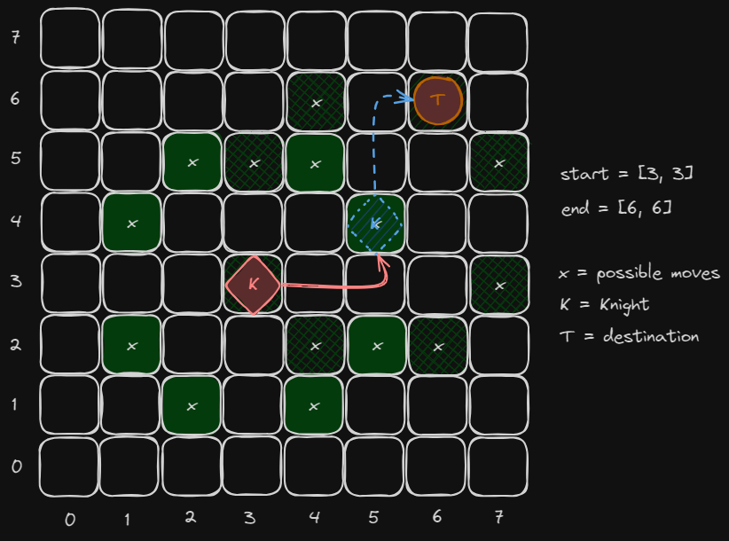

# Knight Travails

Implementing search algorithm on a real problem. For this project, we need to use a graph that similar to binary tree.

Given enough turns, a knight on a standard 8 x 8 chess board can move from any square to any other square. Its basic move is two step forward and one step to the side or one step forward and two steps to the side. It can face any direction.

## Visualization

We need to **find out the minimum steps** (shortest possible way) a Knight will take to reach the target position. Therefore, **BSF** is an appropriate algorithm to solve the problem.

The position is determined based on abscissa and ordinate (x, y).
